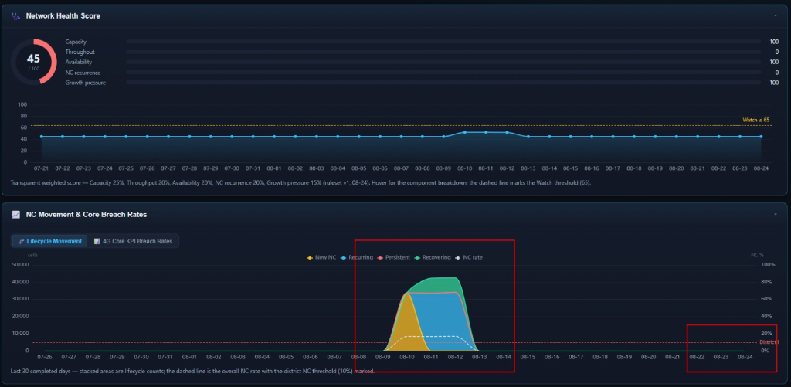
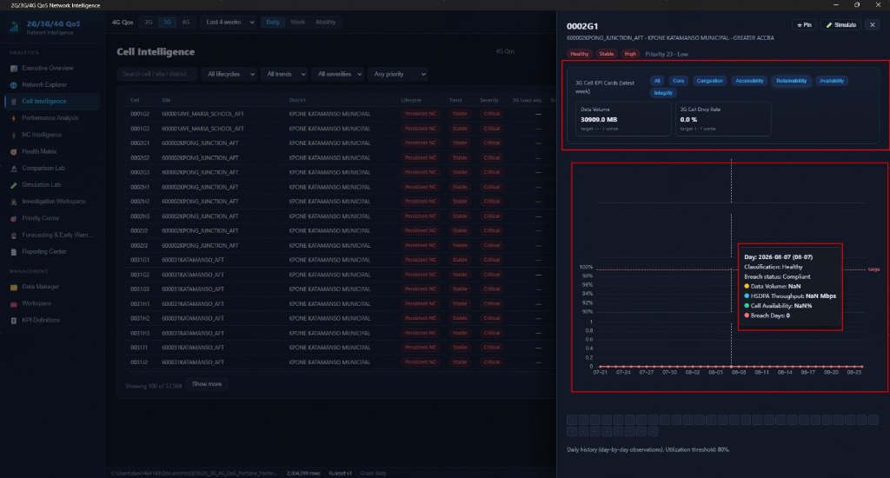
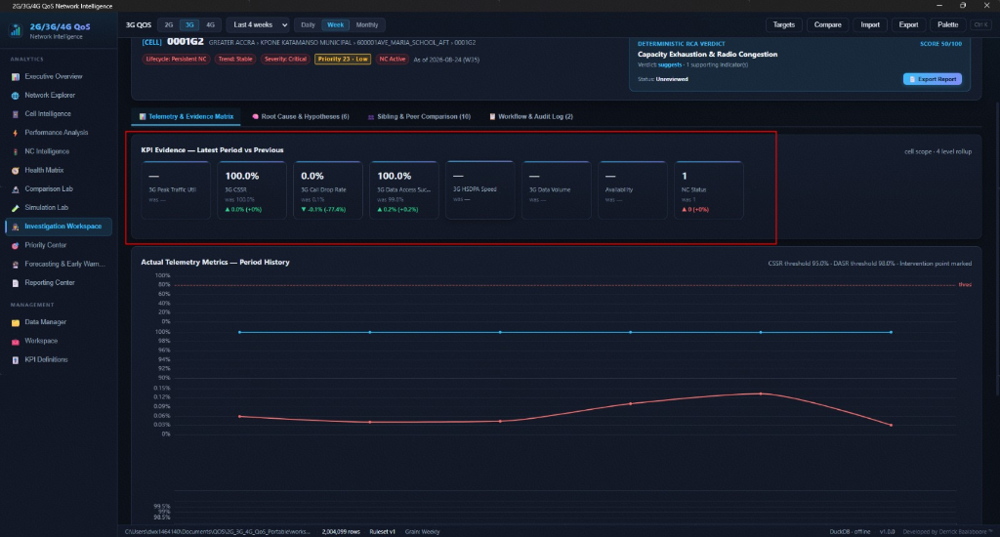
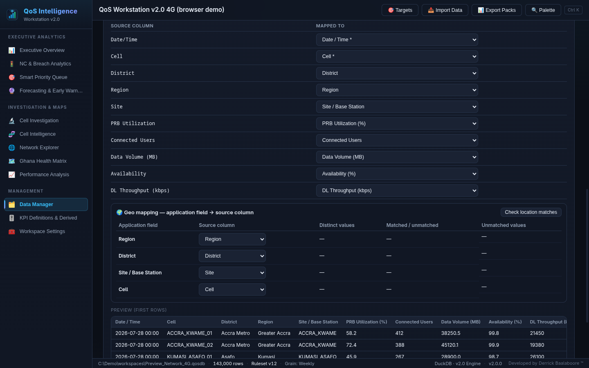

# 2G/3G/4G QoS Network Intelligence Workstation

A portable desktop app for analysing 2G, 3G and 4G cell KPIs against regulatory targets: which cells are non-compliant (NC), for how long, which to fix first, and where things are heading. Built on Electron, React 19 and an embedded DuckDB database; everything runs offline on one machine.

> **Status:** active development on branch `v2`. Checks run on Linux; the Windows portable build has not yet been verified on Windows since the October 2026 changes (import process, DuckDB packaging).

---

## Screenshots

These were taken on 29/08/2026 and predate the October changes (NC periods, complete periods, forecasting).

| Executive Overview | Investigation Workspace |
| :---: | :---: |
|  |  |

| Ghana Health Matrix | Data Manager |
| :---: | :---: |
|  |  |

---

## What goes in

**Files:** `.xlsx` workbooks (every sheet is read, so per-technology or multi-week sheets work; first row = headers) and comma-separated `.csv` / `.txt`. Legacy `.xls` is rejected with a message to save it as `.xlsx` or CSV. Semicolon- or tab-separated text is not supported.

**Columns:** the importer suggests a mapping from the column names (Huawei-style headers such as `4G Peak Hour Traffic Utilization_NCA(%)` or `RRC Connected UEs (Avg)`) and remembers your mapping per file layout. Each column has one **Mapped to** list: a network & cell field (date, cell, site, district, region, users, data volume, throughput, availability, and PRB utilisation in 4G) or any KPI of the workspace's technology.

**Technology:** a workspace holds one technology, chosen when it is created. Keep one workspace per technology: the 2G/3G/4G tabs on each screen and the command palette (**Open 3G workspace**) open the most recently used workspace of that technology, or offer to create one. A file that looks like another technology is stopped with **Open/Create the <T> workspace** or **Import anyway**. Workspaces whose technology was switched by older versions are corrected once when opened, from the technology of their imported KPIs.

**Dates:** day-first (`07/05/2026` is 7 May).

**Duplicates:** one row per cell per day. A row for a cell and day that is already in the workspace is kept and the new one ignored.

---

## Non-compliance (NC)

NC is judged on the regulatory KPIs of each technology, against targets you can edit (**Targets → KPI Targets**, or **KPI Definitions**):

| Technology | NC KPIs (default target) |
| :---: | :--- |
| 2G | Call Connection Success Rate (≥ 95%), Call Drop Rate (≤ 1%), TCH Congestion (≤ 1%), SDCCH Congestion (≤ 1%) |
| 3G | Call Connection Success Rate (≥ 95%), Call Drop Rate (≤ 1%), Data Access Success Rate (≥ 95%) |
| 4G | Call Connection Success Rate (≥ 95%), Call Drop Rate (≤ 1%), Data Service Access Failure (≤ 1%), Peak Hour PRB Utilization (≤ 80%) |

A day is bad when any NC KPI misses its target. A week is NC with ≥ 1 bad day, a month with ≥ 3 bad days (both editable).

### NC periods

Each cell gets one label per day, week and month (first match wins). Defaults, all editable under **Targets → NC Periods**; daily values are the weekly ones × 7:

| Label | Meaning | Weekly | Monthly |
| --- | --- | --- | --- |
| Chronic NC | NC for a long unbroken run | ≥ 7 weeks | ≥ 3 months |
| Persistent NC | NC for a shorter unbroken run | ≥ 3 weeks | ≥ 2 months |
| Intermittent NC | NC again and again with gaps | 3 runs in 7 weeks | 3 runs in 6 months |
| Recurring NC | NC again soon after the last run ended | within 3 weeks | within 2 months |
| New NC | NC, none of the above | | |
| Recovering | not NC, but was recently | ≤ 3 weeks ago | ≤ 2 months ago |
| Healthy | not NC recently (or never) | | |

A week counts for the month(s) its bad days fall in, so a chronic run found in daily data is visible in weekly and monthly too. Full rules: [`docs/superpowers/specs/2026-09-29-nc-lifecycle-design.md`](docs/superpowers/specs/2026-09-29-nc-lifecycle-design.md).

### Complete periods

"Latest week" or "latest month" always means the newest **complete** one (every day imported). A week still in progress is shown, marked `W40 · 3 of 7 days`, but never treated as the current period or compared with full ones. Details: [`docs/superpowers/specs/2026-10-01-complete-periods-design.md`](docs/superpowers/specs/2026-10-01-complete-periods-design.md).

---

## Screens

In the sidebar:

| Screen | What it shows |
| --- | --- |
| **Executive Overview** | Network health and NC summary for the selected technology, the imported KPI cards, NC movement over time, KPI target-breach telemetry |
| **NC & Breach Analytics** | NC labels, trend (Improving / Stable / Worsening), severity (Normal / Watch / High / Critical) across daily, weekly and monthly views |
| **Smart Priority Queue** | Cells, sites and districts ranked 0–100 (bands Critical 90+, High 75+, Medium 50+, Watch 25+, Low); workflow status, owner, ticket and review date per entity, with overdue flags |
| **Forecasting & Early Warning** | Backtested forecasts of imported KPIs, per-cell risk against targets, capacity growth — see below |
| **Cell Intelligence** | Cell cards filtered by severity, with PRB, a telemetry chart drawer and a link to Investigation |
| **Cell Investigation** | One cell, site or district: KPI history, rule-based findings in calibrated language, root-cause hypotheses, before/after comparison around an intervention date, notes, Markdown export |
| **Network Explorer** | Region → district → site → cell drill-down with health roll-ups |
| **Ghana Health Matrix** | 16-region map with a 260-district drill-down (2019 boundaries; Guan District, created in 2021, has no shape yet), and a 4–26-week health heatmap. District names match ignoring case, punctuation and Municipal/Metropolitan; the map lists names it cannot place |
| **Performance Analysis** | Distributions, a PRB-vs-throughput quadrant scatter and a correlation matrix |
| **Data Manager** | Import (analyse → map → preview → import), starter CSV templates, import history and data quality, raw-file archive, maintenance |
| **KPI Definitions & Derived** | Per-technology KPI catalogue (targets, direction, aggregation, aliases) and derived KPIs |
| **Workspace Settings** | Workspace info, snapshots (create, restore, delete, compare two) and recent workspaces |

Also: **Reports** (top bar → Export Packs) and **Comparison Lab** (command palette → Compare Periods or Regions).

### Priority score

Six components weighted 25 / 20 / 15 / 15 / 15 / 10 (PRB severity, persistence, user impact, traffic impact, throughput degradation, worsening trend), plus 20% for how far the cell's KPIs miss their targets. Four alternative modes (customer impact, congestion, persistence, deterioration) re-weight the six.

### Reports

Executive, Engineering, Investigation, Capacity Watch and Custom packs, as Markdown, CSV, HTML, PDF, Excel (`.xlsx`, with native editable charts) or PowerPoint (`.pptx`). Saved report definitions can be scheduled weekly, monthly or quarterly; the app flags overdue ones when it opens (it does not run in the background when closed).

### Derived KPIs

Eight built-in 3G formulas from Huawei counters are suggested when their source columns are present: DL Power, UL CE, DL CE and Downlink Code congestion, Iub transport congestion, physical-channel failures, PS IRAT handover failures and radio-link sync-loss drops. You can define your own (sum, average or ratio) under KPI Definitions.

---

## Forecasting

Every number on the Forecasting screen is an imported value, a forecast from imported values, or an accuracy figure measured on data the model did not see. Full design: [`docs/superpowers/specs/2026-10-03-honest-forecasting-design.md`](docs/superpowers/specs/2026-10-03-honest-forecasting-design.md).

- **Models:** naive (next = last), drift, damped-trend Holt; for daily data also seasonal naive and Holt-Winters with a weekly season.
- **Backtest:** each model is refitted at up to 20 past points using only earlier data, and scored against naive (MASE). A model is used only if it beats naive; otherwise the screen says *no model beats 'same as last period'*.
- **Range:** the 80% band comes from those past errors; with fewer than 5 it is not drawn.
- **Quality:** Good, Fair, Naive only, or Withheld (fewer than 4 complete periods, or a cell with no data in the latest complete period).
- **Risk:** Already Breached, Likely Breach, At Risk, Watch, Stable — read against the current target, so changing a target updates risk immediately. KPIs without a target show growth instead.
- **Horizons:** 1–12 weeks, 1–6 months, 7–28 days; a horizon longer than the history can test is disabled with the reason.
- **Per-cell forecasts** for KPIs with a target and the capacity KPIs are stored and recomputed in the background (a pool of helper processes) when a week or month completes. Measured on a 4-core laptop (Intel i7-6820HQ): 30–37 s for 25,000 cells. The app stays usable meanwhile.
- **Hints** in the risk table (capacity, RF, hardware, parameters, traffic surge) are rules of thumb from imported values, and say so; with no data to judge by they say what is missing.

---

## Workspaces and data safety

- A workspace is one `.qosdb` DuckDB file of one technology. Opening it takes a write lock; a second copy of the app can open it read-only.
- Each import runs in a separate process on its own connection, backs the workspace up first, and rolls back on error.
- The original import files are kept gzip-compressed in `<workspace>.qosdb.raw/` for 90 days.
- Maintenance (Data Manager): integrity check, optimise, rebuild aggregates, compact, purge expired raw files. Rebuild and compact back the workspace up first.
- Snapshots (Workspace Settings): point-in-time copies to restore (the current data is backed up first) or to compare two milestones KPI by KPI.

---

## Development

Developed with Node.js 22 and npm.

```bash
npm install              # also fetches the DuckDB engines for Windows and Linux
npm run dev              # Electron + Vite with hot reload
npm run preview:web      # the UI in a browser on demo data (no Electron)
npm run typecheck
npm test                 # vitest, real DuckDB workspaces
npm run smoke            # headless end-to-end run of the app
npm run verify:packaged  # packages a Linux build and runs the smoke test inside it
npm run bench:forecast   # times a full forecast recompute on 25,000 generated cells
npm run dist:portable    # Windows portable .exe in release/
npm run dist:zip         # Windows portable folder as a .zip
```

Each platform build ships only its own DuckDB engine (`build.win.files` / `build.linux.files` in `package.json`); `scripts/check-package-layout.cjs` fails a build that packs the wrong engine, misses the import or forecast process scripts, or packs anything outside the app. On Linux, `dist:portable` can only check that layout — run the `.exe` on Windows to verify it.

### Layout

```text
shared/             types and rules shared by both processes (API, NC labels, periods, forecast horizons)
src/main/
  analytics/        NC periods, complete periods, priority, health, forecasting engine and risk rules
  forecast/         forecast data layer, stored forecasts, background scheduler and process pool
  import/           file reading, mapping, the import process, aggregates
  services/         query, forecast, investigation, reporting, KPI, snapshot and maintenance services
  workspace/        schema, workspace manager, write lock
  smoke.ts, bench.ts
src/preload/        the IPC bridge exposed to the UI
src/renderer/       React UI: modules (screens), shell, charts and helpers, demo data for preview:web
scripts/            build, packaging and verification scripts
tests/              vitest suites
docs/superpowers/   specs and plans for the 2026 changes
```

`4G_QoS_Network_Intelligence_Master_Design_Spec.md` and `IMPLEMENTATION_PLAN.md` are the original design documents and describe the first version, not the app as it is now.

---

## Known limits

- Legacy `.xls`, `.xlsb`, `.ods` and non-comma CSV are not imported.
- Report schedules only run while the app is open.
- The Windows build since the October 2026 changes is untested on Windows.

## License

MIT — see [LICENSE](LICENSE).

Map data: region boundaries from [virgoaugustine/Ghana-GeoJSON-data](https://github.com/virgoaugustine/Ghana-GeoJSON-data) (MIT); district boundaries from [geoBoundaries](https://www.geoboundaries.org) gbOpen GHA ADM2 (CC BY 4.0; source: USAID Ghana HPNO, Ghana Statistical Service), simplified by `scripts/build-ghana-districts.cjs`.
